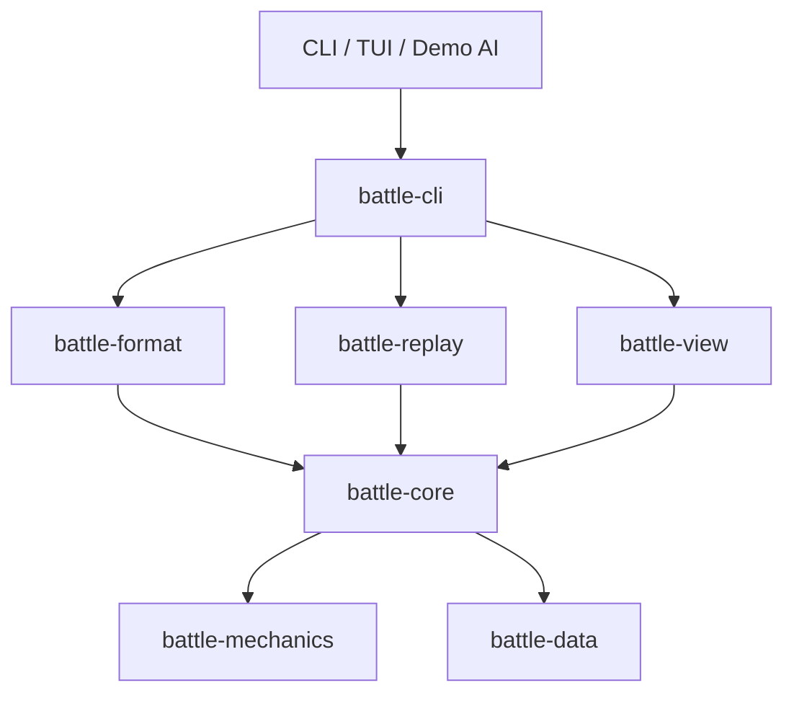
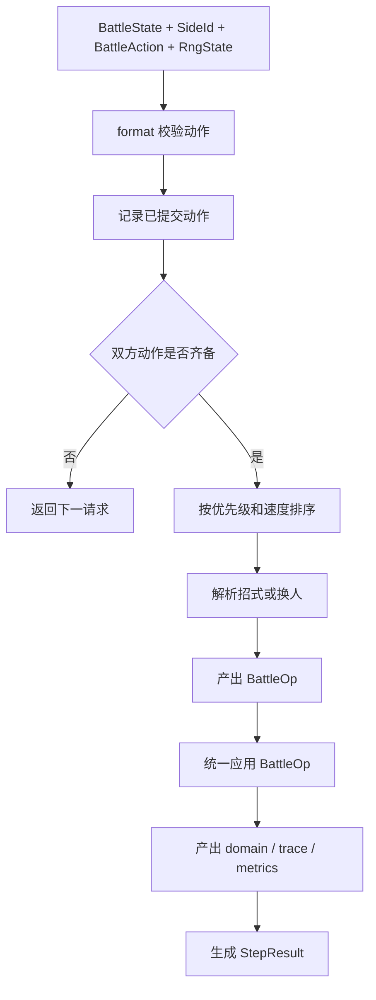
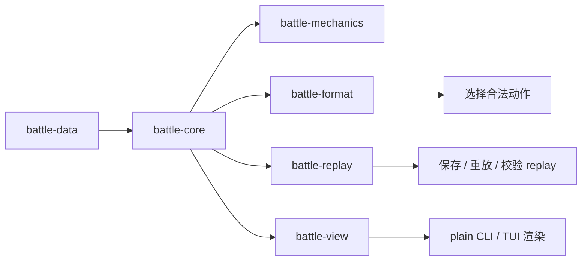
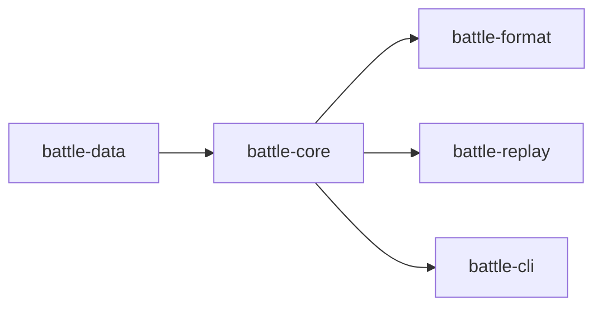

# Shamrock 架构图

## 1. 当前总体结构



说明：

- `battle-core` 是当前唯一权威结算内核
- `battle-data` 提供静态定义和数据表
- `battle-format` 负责当前合法动作边界
- `battle-mechanics` 负责纯规则计算
- `battle-replay` 负责 replay 记录结构、导入导出、重放校验和 checkpoint 恢复
- `battle-view` 负责公开 view-model 投影
- `battle-cli` 当前主要承载 plain CLI、TUI 和 demo AI

## 2. 当前单次结算流程



说明：

- `step` 是权威推进入口
- `legal_actions` 是权威合法动作入口
- 所有状态改动仍然只通过 `BattleOp`
- replay 和外层展示都依赖核心产出的结构化日志

## 3. 当前分层



说明：

- 数据层描述“有什么”
- 核心层描述“怎么推进和写状态”
- 格式层描述“当前允许什么动作”
- 当前公开视图投影已经抽成独立 `battle-view` crate

## 4. 当前已落地边界

- `battle-mechanics` 已落地，用于承接纯规则计算
- `battle-view` 已落地，用于承接公开 view-model 投影
- 当前剩余未完成的高层边界主要在更完整格式、AI 和外壳

## 5. 当前目录结构

```text
crates/
  battle-core/
  battle-data/
  battle-mechanics/
  battle-format/
  battle-replay/
  battle-view/
  battle-cli/
docs/
  README.md
  current/
  architecture/
  systems/
  reference/
replays/
  first-playable-demo.json
```

说明：

- 这是当前真实目录结构
- 当前文档已经按分层披露重组

## 6. 当前阶段推荐依赖方向



这条链路当前足够支持：

- 单打
- 一组基础招式与状态
- 天气和强制换人
- replay 导出与重放校验
- 已抽离的 mechanics / view 边界
- plain CLI 与 TUI

下一阶段的重点不再是继续抽现有边界，而是把格式、AI 与更强外壳做完。
